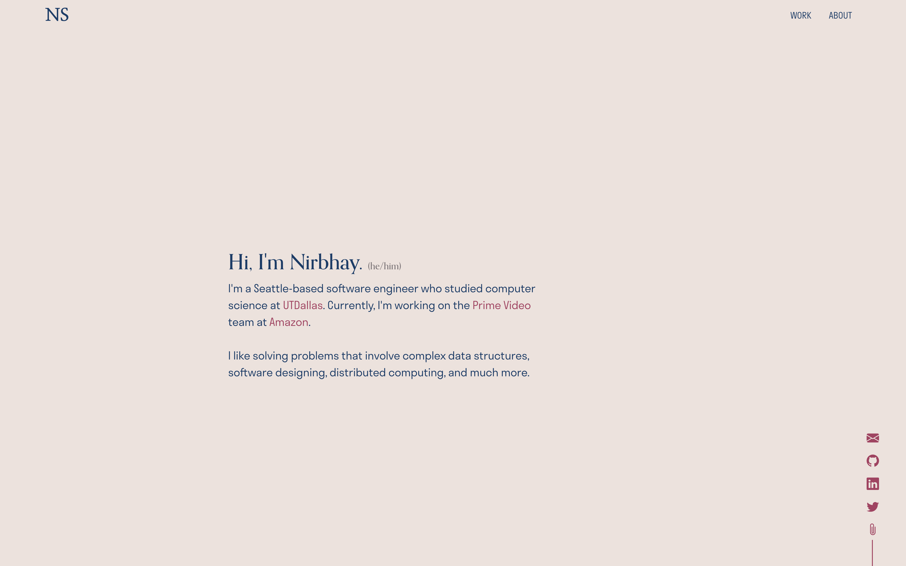

# Portfolio
Repo to host the production build of my portfolio.

Screenshot captured on MacBook Pro (16-inch, 2019) with display resolution scaled to 2048 x 1280, on Google Chrome browser, zoomed at 110%.

Last Updated: 08/07/2021

---

## Notes

* The main branch is here just to hold this ReadMe and save it from getting overwritten during deployments.
* The production build files can be found in [public branch of this repo](https://github.com/nsibal/portfolio/tree/public).
* The code has been deployed for free on [Netlify](https://netlify.com).
* Automatic deployment is enabled.
* For manual deployment, go to Netlify -> Sites -> nsibal.me -> Deploys tab -> Trigger deploy.

---

## Credits

* This page is heavily inspired by [Helen Dempsey](https://twitter.com/helen_dmp/)'s [portfolio](http://helen-dempsey.com/).
* Theme Colors are inspired by [Chordsurfer](http://chordsurfer.redbull.com) by [EPIC](https://www.epic.net/). I found it at [Awwwards](https://www.awwwards.com/sites/chordsurfer#votes).
* Social icons are from [Bootstrap Icons](https://icons.getbootstrap.com).
* Logo has been created using [Canva](http://canva.com/).
* Favicon has been generated using [CloudConvert](https://cloudconvert.com).
* All company logos have either been downloaded from the respective company's official resources or cropped from their social media accounts.

---

Copyright &copy; 2021 Nirbhay Sibal
