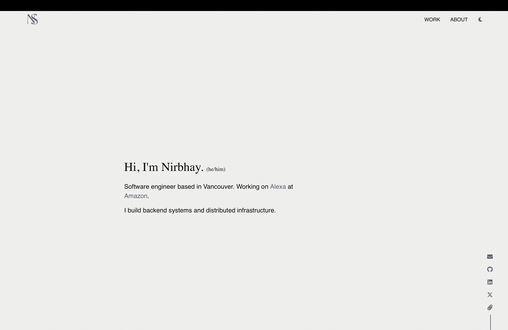
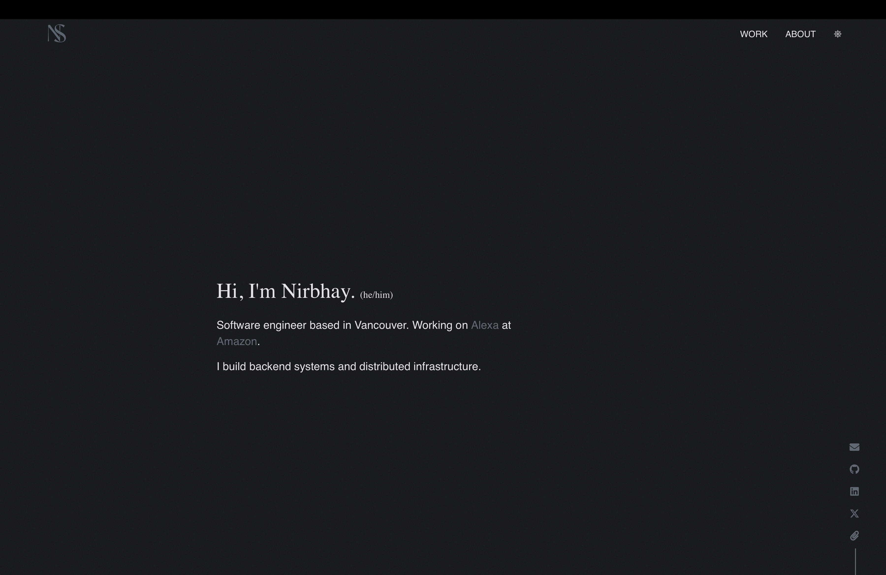

# Portfolio
Repo to host the production build of my portfolio.

| Light | Dark |
|-------|------|
|  |  |

Screenshots captured on MacBook Pro 14" with Apple M1 Pro, with display resolution at 1800 × 1169, on Safari browser.

Last Updated: 05/04/2026

---

## Notes

* The main branch is here just to hold this ReadMe and save it from getting overwritten during deployments.
* The production build files can be found in [public branch of this repo](https://github.com/nsibal/portfolio/tree/public).
* The code has been deployed for free on [Netlify](https://netlify.com).
* Automatic deployment is enabled.
* For manual deployment, go to Netlify -> Sites -> nsibal.me -> Deploys tab -> Trigger deploy.

---

Copyright &copy; 2026 Nirbhay Sibal
